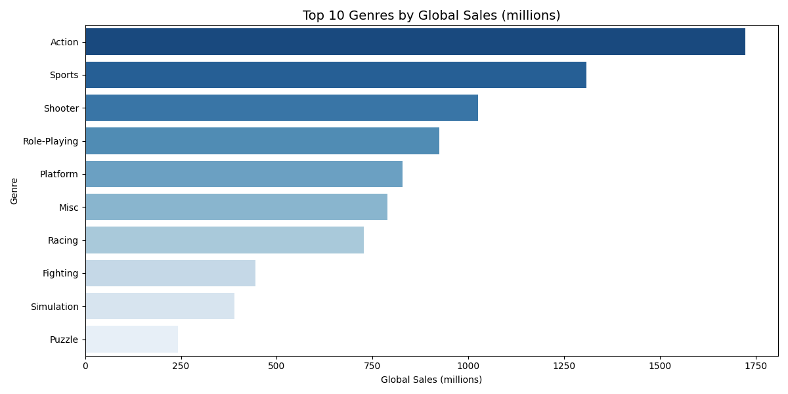
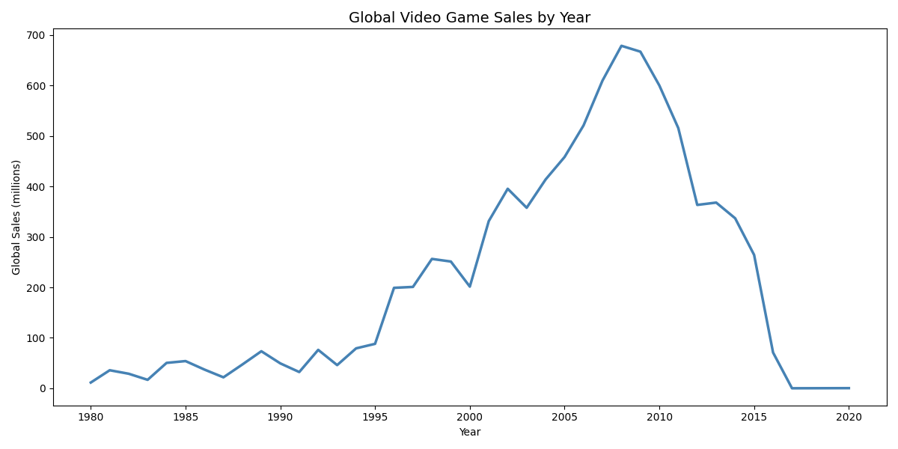
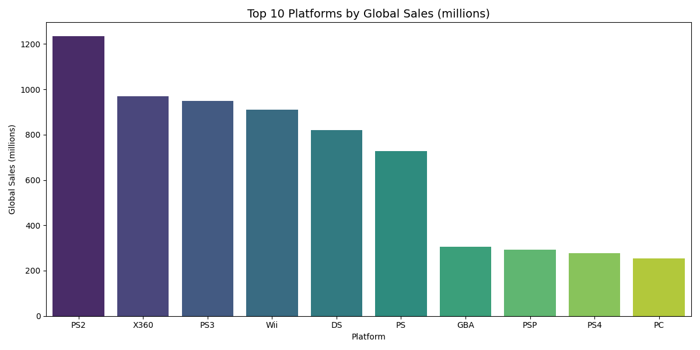

# vgsales-eda
# Video Game Sales - Exploratory Data Analysis

## Overview
Analysis of 16,000+ video game titles using Python to identify sales trends across genres, platforms, and regions.

## Key Findings
- Action is the best-selling genre with 1,700+ million units sold globally
- PS2 is the top platform with 1,200+ million units sold
- Global sales peaked in 2008-2009, followed by a decline (data incomplete after 2016)

## Tools Used
- Python, pandas, matplotlib, seaborn

## Visualizations

## Dataset
Source: Kaggle - Video Game Sales Dataset (16,598 records)
